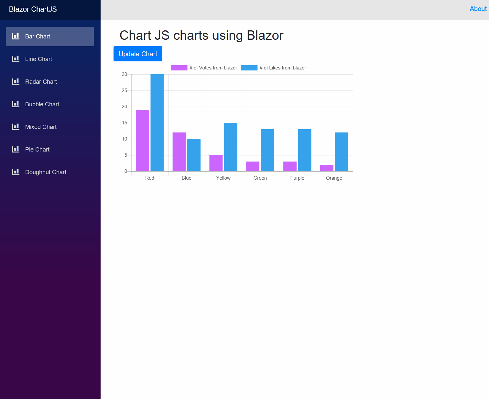

## ChartJs interop with Blazor


This is a Blazor Component that wraps [ChartJS](https://github.com/chartjs/Chart.js).
You can use the library in both client- and server-side projects. See the samples or reach out on Twitter if you need help.

[](https://dev.azure.com/marius-muntean/ChartJs.Blazor/_build/latest?definitionId=4)


[](https://www.nuget.org/packages/ChartJs.Blazor)


## Need your opinion

Let me know how you like ChartJs.Blazor on Twitter [@MunteanMarius](https://twitter.com/@MunteanMarius )

Vote on what features you'd like to see implemented next
[Link to Poll](https://linkto.run/p/CTWCSM51)

Currently I've implemented support for all ChartJs charts. Do you miss anything that makes ChartJs.Blazor a show stopper?

## Changelog
<details open="open">
<summary>v0.9.0</summary>

* Added support for Blazor and Razor Components projects
* Updated to ChartJs 2.8
* Fixed vanishing-chart-bug (thanks community)
* Refactored the core classes of the library so they don't feel so hacky anymore (thanks community)

</details>

<details>
<summary>v0.7.0</summary>

* Updated to Blazor v0.7.0
* Check out the updated samples page. I moved it to [www.iheartblazor.com](https://www.iheartblazor.com)

</details>

<details>
<summary>v0.6.0</summary>

* Extended the support for Legent Item click and hover evnt handler.
* Check out the updated samples page. You can now interact with the chart dataset.

</details>

<details><summary>v0.5.0</summary>

* Added support for Chart Legends with custom Js functions for handling onClick, onHover events for Legend Items.
* Check out the updated samples page. You can now interact with the chart dataset.

</details>

<details ><summary>0.4.0-alpha</summary>

* Simplified some behind-the-scenes code
* Added support for Scatter Chart
* Improved the samples and updated the gif
</details>

<details><summary>0.3.0-alpha</summary>

* Updated object model that exposes even more features of ChartJs
* Added support for Polar Area Chart
</details>

<details><summary>0.2.0-alpha</summary>

* Updated object model that exposes more features of ChartJs
</details>

<details><summary>0.1.0-alpha</summary>

* Initial release. 
* Support for almost all charts from ChartJs, including: LineChart, BarChart, RadarCart, Doughnut- and Pie-Chart, BubbleChart, MixedChart
</details>

## Please keep in mind that this is still a preview. Expect breaking changes during the next releases. I'm using this opportunity to learn Blazor.

## Prerequisites

Don't know what Blazor is? Read [here](https://github.com/aspnet/Blazor)

Prerequisites.

1. Visual Studio 15.8 or later
2. DotNetCore 2.1.402 or later


## Installation 

There's a NuGet package: https://www.nuget.org/packages/ChartJs.Blazor

Install from the command line:

```
Install-Package ChartJs.Blazor
```
or 
```
dotnet add package ChartJs.Blazor
```
**Note:** For server-side projects make sure to add the following line to the `Configure(...)` method of your `Startup.cs` file
```csharp
ChartJsBlazor.AddStaticResourcesToWebRootPath(env.WebRootPath);
```
Then reference the ChartJsInterop.js file from your index.(cs)html like so
```HTML
<script src="~/ChartJs.Blazor/ChartJsInterop.js" type="text/javascript" language="javascript"></script>
```

## Usage

For detailed instruction go to the [Wiki page](https://github.com/mariusmuntean/ChartJs.Blazor/wiki). 

1. In you cshtlm create a new ChartJsPieChart and give it an instance of PieChartConfig ...

```html
<h2>Chart JS charts using Blazor</h2>
<div class="row">
    <button class="btn btn-primary" onclick="@UpdateChart">Update Chart </button>
</div>
<ChartJsPieChart ref="pieChartJs" Config="@pieChartConfig" Width="600" Height="300"/>
```

... make sure to create that instance
```csharp
@functions{

    private PieChartConfig pieChartConfig { get; set; }
    ChartJsPieChart pieChartJs;

    protected override void OnInit()
    {
        pieChartConfig = pieChartConfig ?? new PieChartConfig
        {
            CanvasId = "myFirstPieChart",
            Options = new PieChartOptions
            {
                Text = "Sample chart from Blazor",
                Display = true,
                Responsive = true,
                Animation = new PieChartAnimation {AnimateRotate = true, AnimateScale = true}
            },
            Data = new PieChartData
            {
                Labels = new List<string> {"A", "B", "C", "D"},
                Datasets = new List<PieChartDataset>
                {
                    new PieChartDataset
                    {
                        BackgroundColor = new[] {"#ff6384", "#55ee84", "#4463ff", "#efefef"},
                        Data = new List<int> {4, 5, 6, 7},
                        Label = "Light Red",
                        BorderWidth = 0,
                        HoverBackgroundColor = new[] {"#f06384"},
                        HoverBorderColor = new[] {"#f06384"},
                        HoverBorderWidth = new[] {1}, BorderColor = "#ffffff",
                    }
                }
            }
        };
    }
}
```

2. In your index.html add these

```html
    .
    .
    .
<body>
    <app>Loading...</app>

    <!--<script src="css/bootstrap/bootstrap-native.min.js"></script>-->
    <script src="//cdnjs.cloudflare.com/ajax/libs/Chart.js/2.7.2/Chart.min.js"></script>
    <!--<script src="https://cdnjs.cloudflare.com/ajax/libs/Chart.js/2.5.0/Chart.bundle.min.js"></script>-->
    <link rel="stylesheet" href="//cdnjs.cloudflare.com/ajax/libs/highlight.js/9.12.0/styles/default.min.css">
    <script src="//cdnjs.cloudflare.com/ajax/libs/highlight.js/9.12.0/highlight.min.js"></script>
    <!--<script type="blazor-boot">
            </script>-->
    <script src="_framework/blazor.webassembly.js" type="text/javascript" language="javascript"></script>
    <script src="ChartJsInterop.js" type="text/javascript" language="javascript"></script>
</body>
    .
    .
    .
```


## Samples

Test it in your browser: https://www.iheartblazor.com/


Or just watch me click through the samples



# Contributors
This projects slowly develops a community which started to give back.
## Many thanks to: #
 **Lars** (https://github.com/larshg)
 
 **Jan** (https://github.com/mashbrno)

 I'm very gratefull for your contributions!